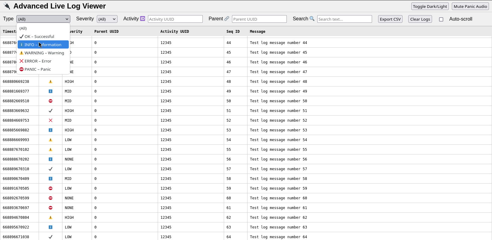

The idea is to provide a simple logging library which can either output to file, or to a Unix Domain Socket which is forwarded as websocket to a webpage (or anything which wants to connect there).
Server and logger can be split, and in theory multiple applications can be forwarded to the same server, allowing us to handle some kind of unified monitoring.  

So far it is little more than a prototype, but it works (Linux, possibly Unix, but no Windows as far as I can tell). And make sure `asio` is installed on your system. In Debian distros it is `libasio-dev`.  

It uses [crow](https://github.com/CrowCpp/Crow) as webserver in its amalgamated header form.  
There is a copy which ships with `vs.logger` itself.

### Notes

This library just started with me testing LLMs to see to which extent they can aid while writing modern C++. Spoiler, not much.  
But the HTML/CSS/JS part is ok-ish if you don't stare too long at the generated code.  

The C++ code required quite a bit of refactoring to make it "operable", and there are still some bugs and questionable design decisions left to fix.  
Still, I think the concept of this library is actually quite nice and useful, so I decided to clean it up a bit for release.  
